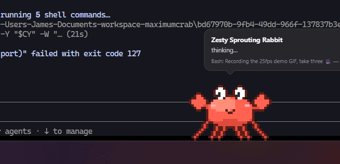
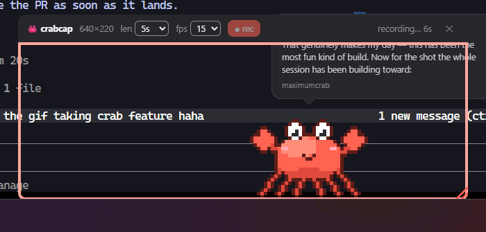

# maximumcrab 🦀

A cute pixel crab that walks along the top of your taskbar and narrates what
Claude Code and your git repos are up to.



*(Actual footage of the crab narrating the recording of this very GIF.)*

## What it does

- **Walks across your screen** in a transparent, click-through, always-on-top
  strip pinned just above the taskbar. It scuttles, pauses, blinks, and
  occasionally waves a claw.
- **Reads Claude Code state** from `~/.claude/projects/*/*.jsonl`. When a
  session is active, a speech bubble shows the session title, Claude's latest
  message, the tool it's currently running, and a spinner while it works.
- **Reads git state** from repos in `~/Documents/workspace` and `~/repos`.
  When Claude is idle, the crab chats about uncommitted files, unpushed
  commits, and branches that are behind.

## Run it

```sh
npm install
npm start
```

## Interacting

- The window is click-through except over the crab and its bubble.
- **Click the crab** — it hops, and toggles the speech bubble on/off.
- **Right-click the crab** (or the tray icon) — pause walking, open the GIF
  capture frame, or quit.

## crabcap 🎥 — built-in GIF recorder

Right-click the crab → **GIF capture frame** to summon a draggable, resizable
frame. Park it over anything (the framed content stays fully clickable — only
the toolbar and corner grip take the mouse), pick a length and fps, hit
**● rec**. The GIF lands in `~/Videos/crabcap/`.



*(A GIF of crabcap taking a GIF of the crab. The crab's GIF also came out
great.)*

### Driving it from an agent

The app listens on `http://127.0.0.1:43117` (loopback only) so any tool that
can `curl` can record GIFs — no vision or reasoning required, which makes it
perfect for a thin skill on a small model:

```sh
curl -sX POST http://127.0.0.1:43117/record \
  -d '{"x":100,"y":200,"width":800,"height":450,"seconds":5,"fps":15}'
# → {"path":"C:\\Users\\you\\Videos\\crabcap\\crabcap-20260712-031500.gif",...}
```

`GET /` returns the full API help text. A ready-made Claude Code skill lives in
[`skills/crabcap/SKILL.md`](skills/crabcap/SKILL.md) — copy the `crabcap`
folder into `~/.claude/skills/` and Claude can take GIFs of your screen on
request.

## How it works

| Piece | Role |
| --- | --- |
| `main.js` | Transparent always-on-top window, tray, polls state every 3s |
| `lib/claude-state.js` | Tails recent session JSONL files, extracts latest assistant text + tool |
| `lib/git-state.js` | `git status --porcelain -b` across workspace repos |
| `renderer/crab.js` | Procedural pixel-art crab (walk / blink / wave frames) |
| `renderer/app.js` | Walking behavior, hop physics, speech bubble |
| `lib/capture.js` | crabcap window + `desktopCapturer` recording orchestration |
| `lib/control-server.js` | Loopback HTTP API (`:43117`) for agent-driven capture |
| `renderer/capture.*` | Capture frame UI + gifenc GIF encoding |

`test/preview.html` renders the sprite poses in a plain browser for tweaking
the pixel art.
